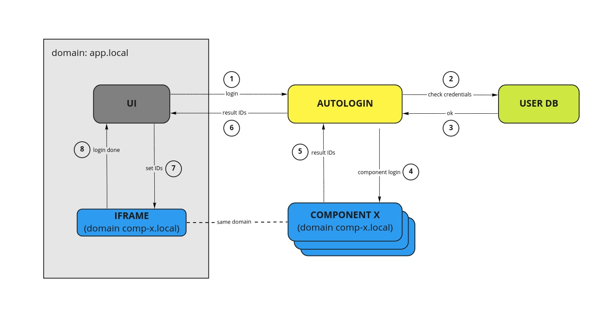

# Autologin 

The goal of this component is to simplify login actions on other different components. To complete the login on each component we use `puppeteer` to do run login on server side. And using JS on an iframe to set credentials on the proper domain.

## Architecture

The autologin component has two important parts: 

1. Server side code to perform login on each component
2. Iframe code to listen for IDs and set them on the same domain as the component it belongs to. 

The iframe on the same domain of each component is achieved by setting up an ingress to have a specific url redirected to the autologin component.

## Autologin flow

The process goes as follow: 

1. Users' credentials are sent from the UI to the server

2. the credentials are check against a users DB

3. the user is authenticated

4. the server perform a login on all other components using `puppeteer` 

5. IDs for each component are collected

6. all IDs are sent back to the UI

7. each ID are sent to an iframe that shares domain with the component it belongs to

8. once the ID is set on that domain the user is logged in that component

## Components to login 

* Gitea
* VSCode
* JupyterHub
* Minio
